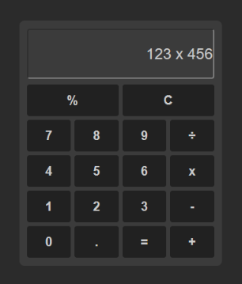

Calculadora em React
====================

Essa é uma calculadora simples feita em React com as operações básicas. A calculadora suporta adição, subtração, multiplicação, divisão, porcentagem e limpeza.

Quickstart
----------

Para rodar a aplicação, siga os seguintes passos:

1.  Clone o repositório para o seu computador;
2.  Abra o terminal e navegue até o diretório do projeto;
3.  Execute o comando `npm install` para instalar as dependências do projeto;
4.  Execute o comando `npm start` para rodar a aplicação;
5.  Abra o navegador e acesse a url `http://localhost:3000/`.

Funcionalidades
---------------

A calculadora possui as seguintes funcionalidades:

*   Adição de números;
*   Subtração de números;
*   Multiplicação de números;
*   Divisão de números;
*   Cálculo de porcentagem;
*   Limpeza da calculadora.

A calculadora também suporta a entrada de dados através do teclado.

Melhorias
---------

Algumas melhorias foram implementadas na calculadora, como:

*   Prevenção da adição de mais de 15 caracteres no input;
*   Verificação da existência do caractere "." na string;
*   Tratamento de erro caso o usuário tente dividir um número por zero;

Tecnologias utilizadas
----------------------

*   React;
*   JavaScript
*   HTML;
*   CSS.

Autor
-----

*   Nome: Nauam Oliveira