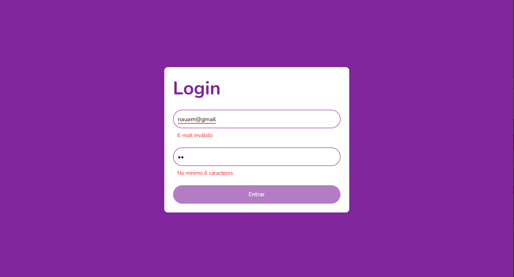

Tela de Login em React
====================

Este projeto foi desenvolvido como parte do curso "Fundamentos do React" da Digital Innovation One e tem como objetivo desenvolver uma tela de login com validação dos campos.

Home Page

Quickstart
----------

Para rodar a aplicação, siga os seguintes passos:

1.  Clone o repositório para o seu computador;
2.  Abra o terminal e navegue até o diretório do projeto;
3.  Execute o comando `npm install` para instalar as dependências do projeto;
4.  Execute o comando `npm start` para rodar a aplicação;
5.  Abra o navegador e acesse a url `http://localhost:3000/`.

Funcionalidades
---------------

A tela de Login possui as seguintes funcionalidades:

*   Validação de email inválido;
*   Validação de senha inválida;
*   Validação de senha com menos de 6 caracteres;
*   Desabilitar o botão de login caso os campos não estejam preenchidos corretamente.

Tecnologias utilizadas
----------------------

*   React;
*   useForm;
*   JavaScript
*   HTML;
*   CSS.

Autor
-----

*   Nome: Nauam Oliveira