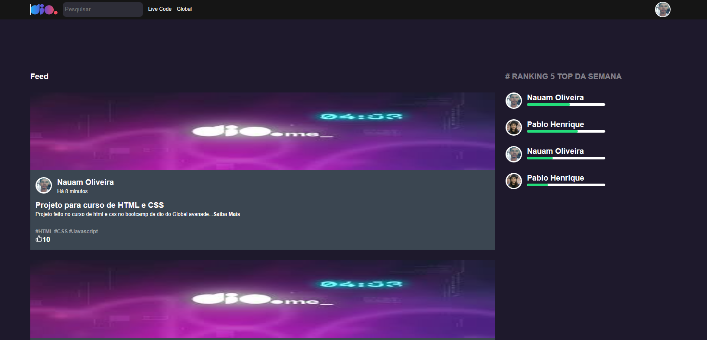

Git Find em React
====================

Este projeto foi desenvolvido como parte do curso "Fundamentos do React" da Digital Innovation One e tem como objetivo desenvolvendo as principais telas da plataforma Dio com React.

Home Page

Login

Feed

Quickstart
----------

Para rodar a aplicação, siga os seguintes passos:

1.  Clone o repositório para o seu computador;
2.  Abra o terminal e navegue até o diretório do projeto;
3.  Execute o comando `npm install` para instalar as dependências do projeto;
4.  Execute o comando `npm start` para rodar a aplicação;
5.  Abra o navegador e acesse a url `http://localhost:3000/`.

Funcionalidades
---------------

As principais telas da plataforma Dio possui as seguintes funcionalidades:

*   Navegação entre as telas através de botões;	
*   Navegação entre as telas através de links;
*   Exibição das telas home (/), login (/login) e feed (/feed);
*   Exibição de cards com informações sobre os bootcamps e eventos;

Tecnologias utilizadas
----------------------

*   React;
*   useNavigate (React Router);
*   JavaScript
*   HTML;
*   CSS.

Autor
-----

*   Nome: Nauam Oliveira