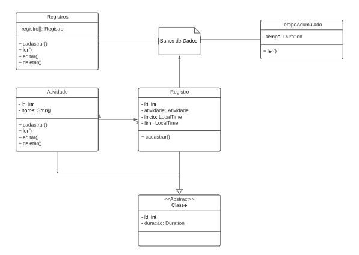

# Gestão de Tempo - Pomodoro  :tomato:

   
 

### Tópicos 

:small_blue_diamond: [Descrição do projeto](#descrição-do-projeto)

:small_blue_diamond: [Funcionalidades](#funcionalidades)

:small_blue_diamond: [Diagrama de classes](#diagrama-de-classes)

## Descrição do projeto 

    Uma gestão de tempo ou pomodoro de fácil utilização, focado em metas diárias, semanais ou mensais.

## Funcionalidades

:heavy_check_mark: Temporizador: Inicie, termine de uma atividade especifica, podendo haver alvos de registros e/ou periodo de tempo.

:heavy_check_mark:Historico: Adicionas, ver, atualizar e apagar registros diarios ou semanais.

:heavy_check_mark:Estatistica: ​Tempo total das atividades por periodo de tempo.

    Uma gestão de tempo ou pomodoro de fácil utilização, focado em metas diárias, semanais ou mensais.

## Diagrama de classes

## Interface Gráfica

### Tela Inicial 

:building_construction: Icon 1 - Mostra os registros. (EM CONSTRUÇÃO - apenas mostrará os registros no console) 

:heavy_plus_sign:  Icon 2 - Adiciona registros.  (Abre: Tela Configuração de Registro)

### Tela Configuração Registro

Definir a atividade e a tempo alvo do Pomodoro (HH:MM:SS)

:heavy_check_mark: Icon 1 - Mostra os registros. (Abre: Tela Configuração de Registro)

:heavy_multiplication_x: Icon 2 - Adiciona registros. (Abre: Tela Inicial)

### Tela Registro

:clock1: Relogio 1: Mostra o tempo decorrido.

:clock1: Relogio 2: Mostra o tempo alvo.

:clock1: Relogio 1: Mostra o tempo restante.

:play_or_pause_button: Play/Pause: Inicia e salva o registro na lista.

<   Return:  (Abre: Tela Inicial).

:  Configuração: (Abre: Tela Configuração de Registro).

:information_source: Quando o alvo for alcançado, será mostrado uma mensagem, o cronometro ainda continuarar contando:

## Licença

The [MIT License]() (MIT)

Copyright &copy; 2021 - UnB Orienteção a Objeto - Nauam Oliveira
