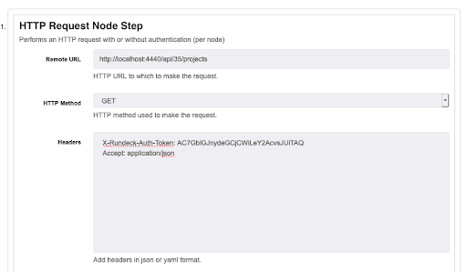

# JSON jq key/value mapper

This log filter will parse JSON data in a QW Control job step and create key-value data as QW Control variables in the data context. The filter uses the jq library to make jquery searches into the data returns.

## Usage

The filter has 3 fields:

- *jq Filter*
  - jquery-style filter against the log output for the QW Control job step this filter is attached to. Required.
- *Prefix*
  - optional result prefix that will be used in the QW Control data context as the variable key.
- *Log Data*
  - checkbox. If true, log the captured data to the job’s log stream.

The example below will filter the log results of a QW Control API query. Using the HTTP Request Node Step and a working API token for your QW Control user:

The API results in our demo QW Control instance look like this:

Apply the JSON jq key/value Mapper filter to the HTTP Request node step:

Now, when running the job, the log filter creates the following data variable:

So it can be used in later job steps:

With the results:

