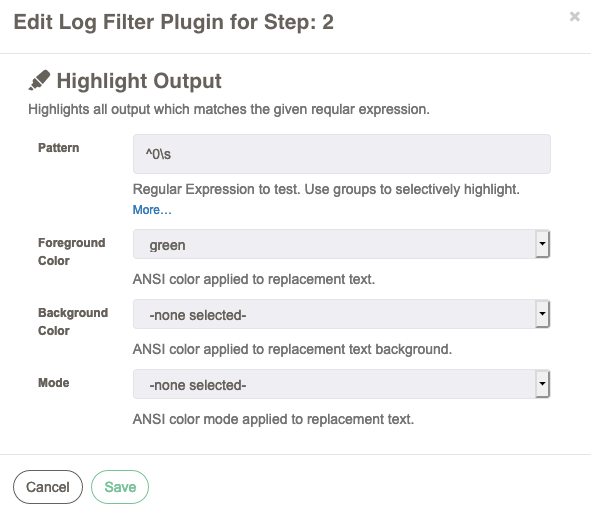
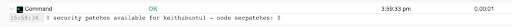

# Saída de destaque

Este filtro de log analisa a saída de log de uma passo do fluxo de trabalho e destaca a saída que corresponde a uma determinada expressão regular. Este filtro altera a saída de exibição no QW Control, mas não altera os próprios logs.

## Uso

Este filtro possui quatro opções:

- Padrão
  - regex para testar a saída do log
- Cor do primeiro plano
  - uma lista suspensa de cores ANSI para aplicar ao texto destacado
- Cor de fundo
  - uma lista suspensa de cores ANSI a serem aplicadas ao plano de fundo do texto destacado.
- Modo
  - uma lista suspensa de opções de texto (negrito, sublinhado, intermitente e reverso) para aplicar ao texto destacado.

O regex de texto selecionado tem várias opções. Uma regex sem um grupo de captura simplesmente destacará qualquer texto que corresponda ao que está na regex e aplicará as cores e o modo apenas à frase correspondente. Os grupos de captura em uma regex destacarão todo e qualquer grupo de captura na regex, deixando de fora todo o resto correspondido pela expressão regular.

## Exemplo

Esta configuração filtrará a saída do log procurando um "0" (zero) inicial na saída do log da passo do job anexada. Se corresponder, o resultado será assim:

