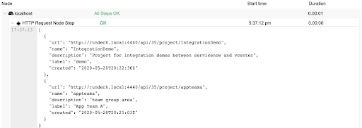
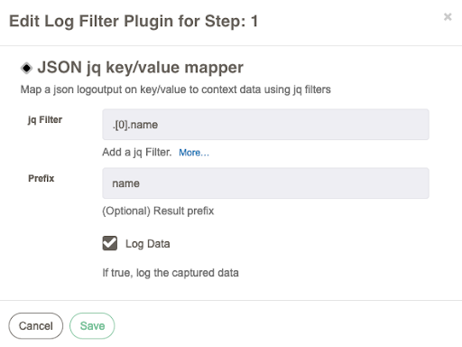
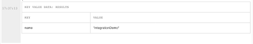
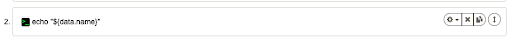
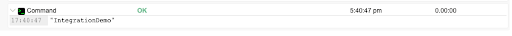

# JSON jq key/value mapper

Este filtro de log analisará os dados JSON em uma etapa do trabalho QW Control e criará dados de valor-chave como variáveis ​​QW Control no contexto de dados. O filtro usa a biblioteca jq para fazer pesquisas jquery nos dados retornados.
## Uso

O filtro possui 3 campos:

- *jq Filter*
  - filtro de estilo jquery em relação à saída de log para a etapa do trabalho QW Control ao qual este filtro está anexado. Obrigatório.
- *Prefix*
  - prefixo de resultado opcional que será usado no contexto de dados do QW Control como a chave variável.
- *Log Data*
  - caixa de seleção. Se verdadeiro, registre os dados capturados no fluxo de registro do trabalho.

O exemplo a seguir filtrará os resultados do log de uma consulta da API QW Control. Usando a Etapa de Nó de Solicitação HTTP e um token de API funcional para seu usuário QW Control:

Os resultados da API em nossa instância de demonstração do QW Control são assim:

Aplique o filtro do mapeador de chave/valor JSON jq à etapa do nó de solicitação HTTP:

Agora, ao executar o trabalho, o filtro de registro cria a seguinte variável de dados:

Portanto, ele pode ser usado em etapas de trabalho posteriores:

Com os resultados:

