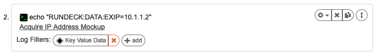
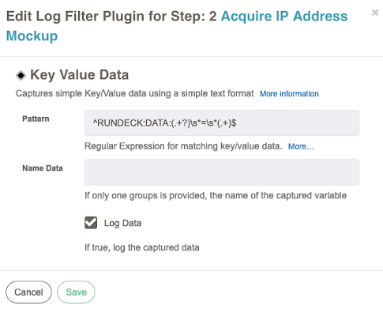
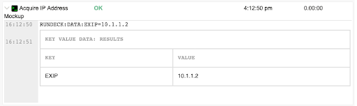

# Dados de valor-chave

O filtro de registro de dados de valor-chave pode analisar a saída de uma etapa do fluxo de trabalo com uma expressão regular para criar dados de chave/valor que são exportados para o fluxo de trabalo como uma variável de contexto para uso em passos posteriores do fluxo de trabalo.

::: tip DICA
Este plugin pode capturar apenas valores de dados que são registrados em uma única linha de saída de log.

Se você deseja capturar várias linhas de saída, consulte o [Multiline Regex Capture](/user-guide/log-filters/multi-line-regex.html#usage) plugin.
:::

## Uso

Existem apenas três componentes de configuração:

- Padrão
- Dados do nome
- Dados de registro (caixa de seleção)

O campo Padrão corresponde a uma expressão regular e procura um ou dois Grupos de Captura. Se houver dois grupos de captura, o primeiro será mapeado para uma chave variável de QW Control no contexto de dados, enquanto o segundo será o valor. Se houver apenas um Grupo de captura, a correspondência será o valor.

O campo Name Data é usado apenas quando um único Grupo de Captura é definido na instrução regex. O valor desse campo será usado como a chave variável. O valor da variável será o conteúdo do Grupo de captura.

Dados de log é uma caixa de seleção que, se marcada, adicionará uma saída tabular do que é capturado no filtro à saída de log do Job ao qual o filtro está anexado.

Por padrão, o campo padrão é definido como: `^QWCONTROL:DATA:(.+?)\s*=\s*(.+)$`

Isso corresponderá à saída do Job anexado se houver uma linha na saída do registro que começa com _QWCONTROL:DATA:foo=value1_. Os dados estão disponíveis em passos posteriores do Job como a variável de QW Control `$data.foo` com um valor de tudo após o sinal de igual no final da linha. Portanto, neste caso, o valor de `$data.foo` seria _value1_.

Na seção Avançado, também há um Padrão de caractere inválido. Esta é uma expressão regular que corresponde a caracteres indesejados no valor correspondente do campo Padrão. Por padrão, QW Control filtra espaços em branco e caracteres típicos de chamadas de variáveis QW Control como `$, {, }, and \`.

## Exemplos

O filtro de registro neste exemplo é totalmente padrão, com o campo Dados de registro marcado:

A saída quando o Job é executado é assim:

Em passos posteriores do Job, consulte `$data.EXIP` em comandos ou `@data.EXIP@`em scripts para o valor _10.1.1.2_.

## Veja também

- [Multiline Regex Capture](/user-guide/log-filters/multi-line-regex.html#usage) que pode capturar várias linhas de saída de log em uma variável de dados.
