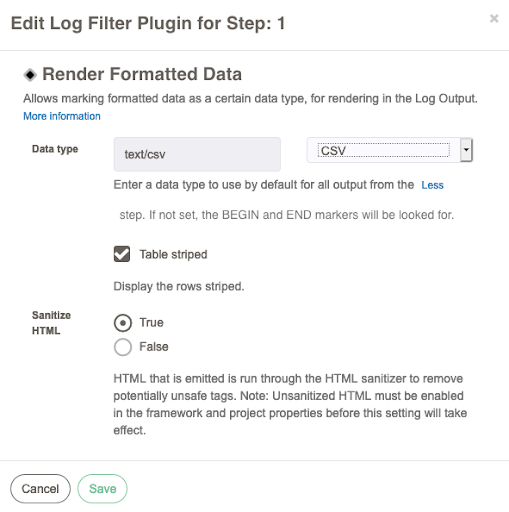
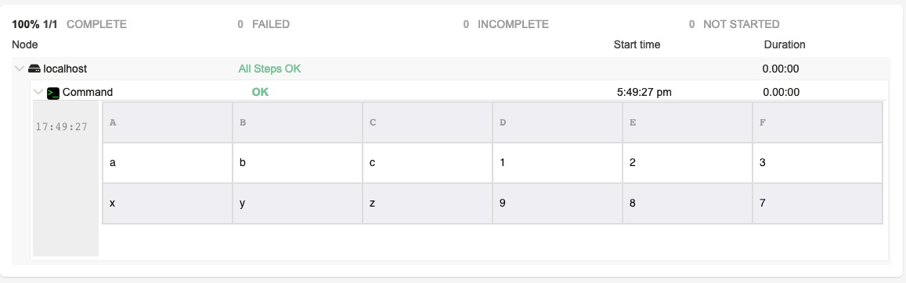

# Renderizar dados formatados

Este é um filtro de registro de apresentação de dados - o que significa que este filtro não altera a saída de registro da passo do job ao qual é aplicado; em vez disso, ele adiciona alguns metadados aos logs, permitindo que o QW Control os renderize em HTML higienizado pelo uso de [Plugins de conversão de conteúdo](/developer/content-converter-plugins.html). Isso é particularmente útil para exibir os valores de retorno de scripts e chamadas de API.

A saída será uma tabela HTML com os dados formatados apropriadamente.

## Uso

Primeiro, certifique-se de que a passo do job está retornando uma saída que pode ser analisada por um dos tipos de dados do filtro. Se a saída do job for inteiramente do tipo de dados esperado, defina o campo Tipo de dados no filtro de registro para o tipo apropriado. Caso contrário, o QW Control espera um prefixo e sufixo para os dados analisáveis. Para marcar uma seção de saída com um tipo de dados, ecoa este marcador definindo-o:

    `#BEGIN:QWCONTROL:DATATYPE:<datatype>`

Substituindo `<datatype>` por um dos tipos de dados suportados.

Você pode marcar a seção como terminando repetindo a linha abaixo. Caso contrário, quando a passo terminar, o plug-in a tratará como encerrada.

    `#END:QWCONTROL:DATATYPE`

Tipos de dados suportados:

- `application/json` [JSON][] (sinônimos: `json`)
- `application/x-java-properties` [Java Properties][] (sinônimos: `properties`)
- `text/csv` CSV (sinônimos: `csv`)
- `text/html` HTML (sinônimos: `html`)
- `text/x-markdown` [Markdown][] (sinônimos: `markdown`,`md`)

[json]: http://json.org
[markdown]: https://en.wikipedia.org/wiki/Markdown
[java properties]: https://docs.oracle.com/javase/7/docs/api/java/util/Properties.html#load(java.io.Reader)

### Use para todas as saídas

Você também pode escolher um valor para a propriedade `Data Type`, para predefinir um tipo de dados a ser usado para todos os dados de registro de saída. Se estiver definido, nenhum marcador "BEGIN" é procurado.
Os dados podem ser renderizados na GUI de saída do log de controle QW. O renderizador específico para o tipo de dados é determinado pelos plug-ins ViewConverter disponíveis.

Por exemplo, você pode emitir dados JSON e prefixá-los com:

    echo "#BEGIN:QWCONTROL:DATATYPE:application/json"

Em seguida, emita dados json (apenas)

    cat file.json

Então END o tipo de dados:

    echo "#END:QWCONTROL:DATATYPE"

A saída do log irá capturar todos os dados JSON em um único evento de log e marcá-lo como tipo de dados `application/json`.

## Exemplos

### Veja também

- [Plugins de conversão de conteúdo](/developer/content-converter-plugins.html)
